<picture></picture>

<picture></picture>

  <picture>
    <source media="(prefers-color-scheme: dark)" srcset="https://raw.githubusercontent.com/RennerCassiano/RennerCassiano/output/snake-dark.svg">
    <source media="(prefers-color-scheme: light)" srcset="https://raw.githubusercontent.com/RennerCassiano/RennerCassiano/output/snake-light.svg">
    
  </picture>

<!-- ===== SOCIAL BADGES ===== -->
 

  
  &nbsp;&nbsp;
  
  &nbsp;&nbsp;
  

